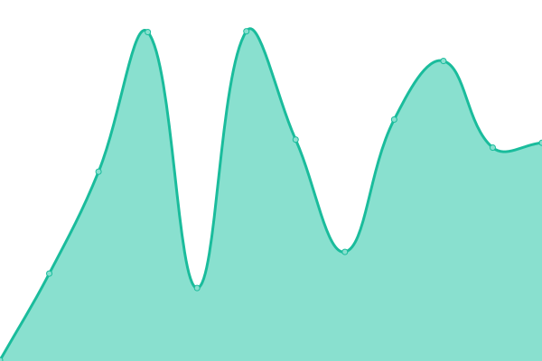

# [📈 Live Status](https://status.educup.io): <!--live status--> **🟩 All systems operational**

This repository contains the open-source uptime monitor and status page for [EducUp](https://educup.io), powered by [Upptime](https://github.com/upptime/upptime).

With [Upptime](https://upptime.js.org), you can get your own unlimited and free uptime monitor and status page, powered entirely by a GitHub repository. We use [Issues](https://github.com/educup/status-page/issues) as incident reports, [Actions](https://github.com/educup/status-page/actions) as uptime monitors, and [Pages](https://status.educup.io) for the status page.

<!--start: status pages-->
<!-- This summary is generated by Upptime (https://github.com/upptime/upptime) -->
<!-- Do not edit this manually, your changes will be overwritten -->
<!-- prettier-ignore -->
| URL | Status | History | Response Time | Uptime |
| --- | ------ | ------- | ------------- | ------ |
|  [EducUp Website](https://www.educup.com) | 🟩 Up | [educ-up-website.yml](https://github.com/educup/status-page/commits/HEAD/history/educ-up-website.yml) | 

 235ms
     
 | 

<a href="https://status.educup.io/history/educ-up-website">100.00%</a>
    

|  [EducUp Admin](https://admin.educup.io) | 🟩 Up | [educ-up-admin.yml](https://github.com/educup/status-page/commits/HEAD/history/educ-up-admin.yml) | 

 320ms
     
 | 

<a href="https://status.educup.io/history/educ-up-admin">100.00%</a>
    

|  [EducUp Apps](https://apps.educup.io) | 🟩 Up | [educ-up-apps.yml](https://github.com/educup/status-page/commits/HEAD/history/educ-up-apps.yml) | 

 423ms
     
 | 

<a href="https://status.educup.io/history/educ-up-apps">100.00%</a>
    

|  [EducUp API](https://api.educup.io/health) | 🟩 Up | [educ-up-api.yml](https://github.com/educup/status-page/commits/HEAD/history/educ-up-api.yml) | 

 218ms
     
 | 

<a href="https://status.educup.io/history/educ-up-api">100.00%</a>
    

|  [EducUp Tutors API](https://tutorsapi.educup.io/health) | 🟩 Up | [educ-up-tutors-api.yml](https://github.com/educup/status-page/commits/HEAD/history/educ-up-tutors-api.yml) | 

 210ms
     
 | 

<a href="https://status.educup.io/history/educ-up-tutors-api">100.00%</a>
    

|  [EducUp Studio API](https://studioapi.educup.io/health) | 🟩 Up | [educ-up-studio-api.yml](https://github.com/educup/status-page/commits/HEAD/history/educ-up-studio-api.yml) | 

 223ms
     
 | 

<a href="https://status.educup.io/history/educ-up-studio-api">100.00%</a>
    

|  [EducUp Extenal API](https://externalapi.educup.io/health) | 🟩 Up | [educ-up-extenal-api.yml](https://github.com/educup/status-page/commits/HEAD/history/educ-up-extenal-api.yml) | 

 232ms
     
 | 

<a href="https://status.educup.io/history/educ-up-extenal-api">100.00%</a>
    

<!--end: status pages-->

[**Visit our status website →**](https://status.educup.io)

## 📄 License

- Powered by: [Upptime](https://github.com/upptime/upptime)
- Code: [MIT](./LICENSE) © [EducUp](https://educup.io)
- Data in the `./history` directory: [Open Database License](https://opendatacommons.org/licenses/odbl/1-0/)
